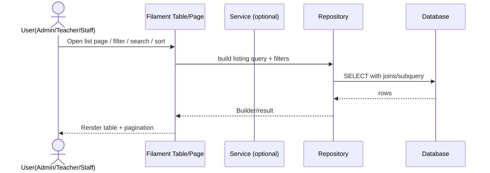
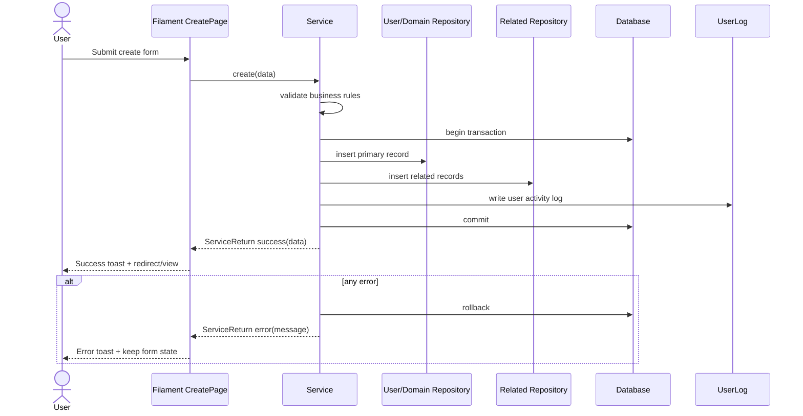
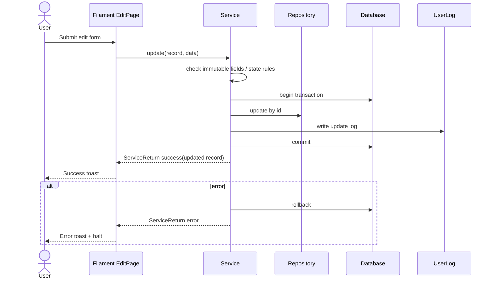
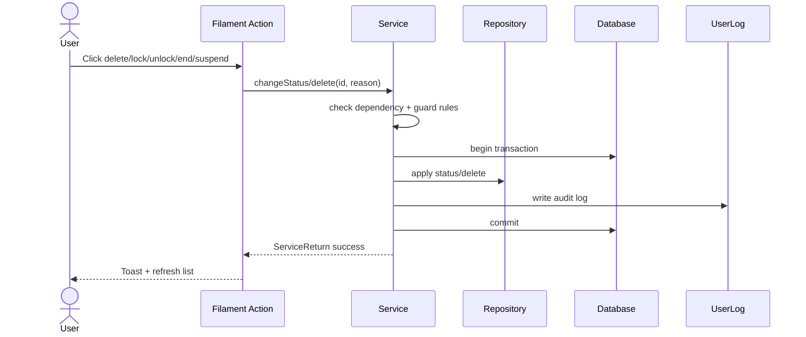
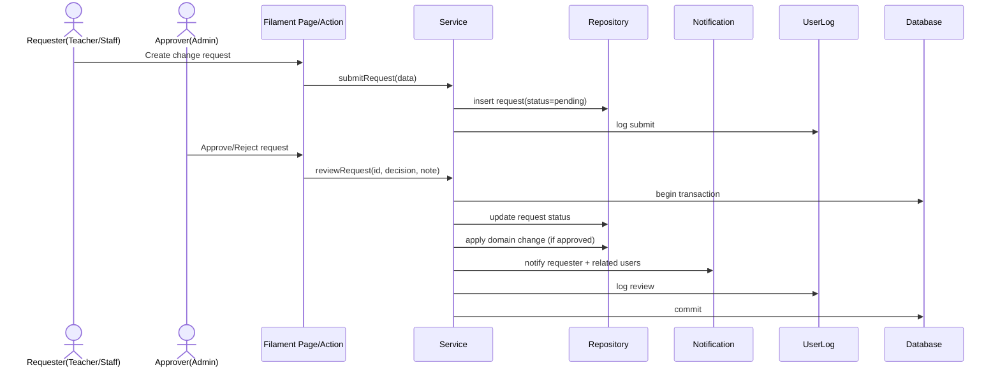
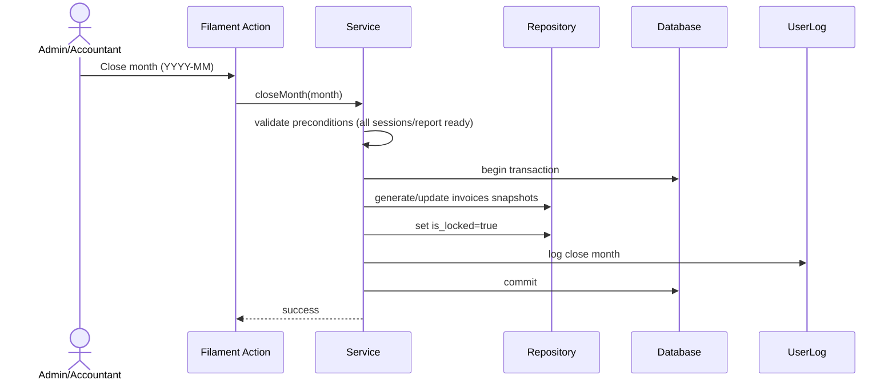

# Sequence Flow Chuan Hoa Toan Du An (ERP TriTue8)

## 1) Muc tieu
Tai lieu nay dinh nghia sequence flow chuan de tat ca resource/module (G1 -> G6) tuan theo cung mot kieu trien khai.

Ap dung cho:
- Filament Resources/Pages/Tables/Actions
- Services
- Repositories
- Models + DB
- Logging + Notification + Permission

## 2) Kien truc chuan
Luong xu ly bat buoc:
1. UI Layer: Filament Resource/Page/Table Action
2. Application Layer: Service (business rules, transaction, orchestration)
3. Data Layer: Repository (query/read/write)
4. Persistence Layer: Eloquent Model + Database

Nguyen tac:
- Page/Table KHONG chua business logic phuc tap.
- Service la noi duy nhat xu ly rule nghiep vu va transaction.
- Repository chi xu ly truy van/du lieu.
- Moi action quan trong phai ghi user_logs.

## 3) Sequence flow chuan

### 3.1 Read/List flow (Index/Table)


Quy uoc:
- Neu chi la read query, co the F -> R truc tiep.
- Neu read can rule nghiep vu phuc tap (scope theo role, month lock,...) thi F -> S -> R.

### 3.2 Create flow (Form submit)


Quy uoc:
- Tat ca create co ghi nhieu bang phai chay transaction.
- Loi nghiep vu tra ve ServiceReturn error de UI hien thi ro rang.

### 3.3 Update flow


### 3.4 Delete/Soft-delete/Status change flow


Quy uoc:
- Trang thai (lock/end/suspend/cancel) uu tien hon hard delete.
- Neu action la quan trong (tai chinh, diem danh, lich hoc) phai luon qua Service.

### 3.5 Approval workflow (pending -> approved/rejected)


### 3.6 Monthly close/lock flow (finance/attendance)


Quy uoc:
- Sau lock: khong sua truc tiep invoice/session quan trong.
- Dieu chinh qua logs/adjustment records.

## 4) Error handling chuan
- Service dung `BaseService::execute()` de xu ly transaction + rollback + return `ServiceReturn`.
- Loi nghiep vu: throw `ServiceException` voi message ro rang cho end-user.
- Loi he thong: log critical + tra message chung an toan.
- Filament Page bat `isError()` -> thong bao toast + `Halt` de giu du lieu form.

## 5) Authorization flow chuan
Moi action nhay cam phai check 3 lop:
1. UI visibility (an/hien button theo role).
2. Policy/permission (backend gate).
3. Service guard (check trang thai nghiep vu, ownership, month lock).

Khong duoc chi dua vao visibility o UI.

## 6) Logging va traceability
Moi action quan trong phai ghi `user_logs`:
- action key (vd: create_student, update_class, approve_schedule_change)
- actor (user_id)
- target (model/id)
- old_values/new_values (neu co)
- reason/note (neu action doi trang thai)

Khuyen nghi bo sung correlation_id cho cac flow dai (optional).

## 7) Quy tac coding de cac Resource khac tuan theo

### 7.1 Page/Table layer
- Chi lam cac viec:
  - validate form co ban (required/format)
  - goi Service
  - hien thi Notification
  - dieu huong/refresh
- Khong viet query nghiep vu phuc tap trong Page (ngoai listing/filter don gian).

### 7.2 Service layer
- Chiu trach nhiem:
  - business rule
  - transaction
  - orchestration nhieu repository
  - ghi log, trigger notification
- Return `ServiceReturn` thong nhat.

### 7.3 Repository layer
- Chiu trach nhiem:
  - query builder
  - CRUD
  - reusable data access methods
- Khong chua business state machine.

## 8) Template pseudo-code chuan

### 8.1 Page action template
```php
$result = $service->executeUseCase($data);
if ($result->isError()) {
    Notification::make()->danger()->title('Error')->body($result->getMessage())->send();
    throw new Halt();
}
return $result->getData();
```

### 8.2 Service template
```php
public function executeUseCase(array $data): ServiceReturn
{
    return $this->execute(function () use ($data) {
        // 1) validate business
        // 2) call repositories
        // 3) log activity
        return ServiceReturn::success($payload);
    }, useTransaction: true);
}
```

## 9) Checklist bat buoc khi tao resource moi
- [ ] Form schema ro rang va dung enum/constants.
- [ ] Page action goi service (khong viet logic thang vao page).
- [ ] Service co transaction cho write flow.
- [ ] Repository co method listing/filter tai su dung.
- [ ] Co user_logs cho action create/update/status/approve/close.
- [ ] Co role/permission check o backend.
- [ ] Co test cho flow thanh cong + that bai + rollback.

## 10) Mapping nhanh theo module
- G1 Auth/Profile: create/update/lock account theo flow 3.2-3.4.
- G2 Hoc vu: subject/room/class/enrollment + monthly_reports theo flow 3.2-3.5.
- G3 Lich hoc: template -> instance + change request approval theo flow 3.5.
- G4 Diem danh/diem: session -> records -> scores theo flow 3.2-3.3.
- G5 Tai chinh: invoice generation + lock month theo flow 3.6.
- G6 He thong: user_logs + notifications cho tat ca flow tren.

---
File nay la standard architecture contract cho toan bo resource moi trong du an.
